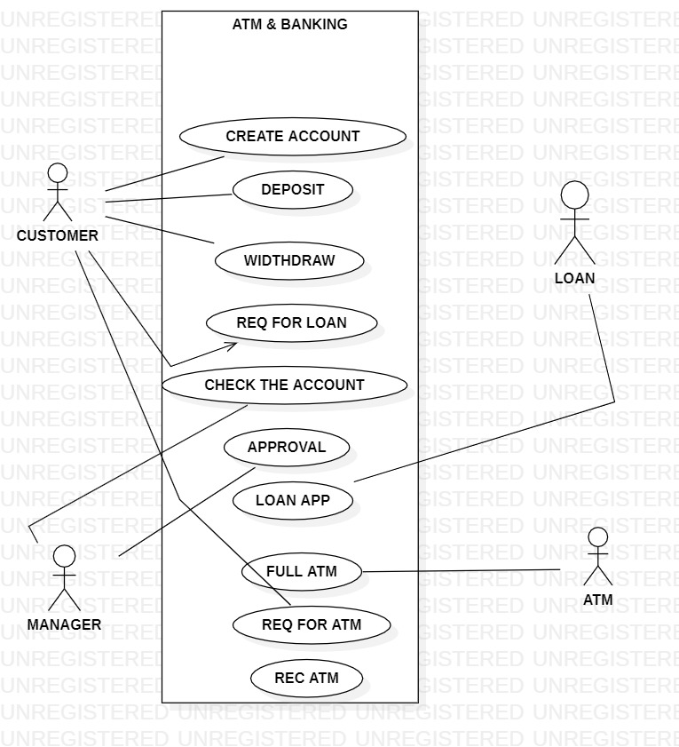
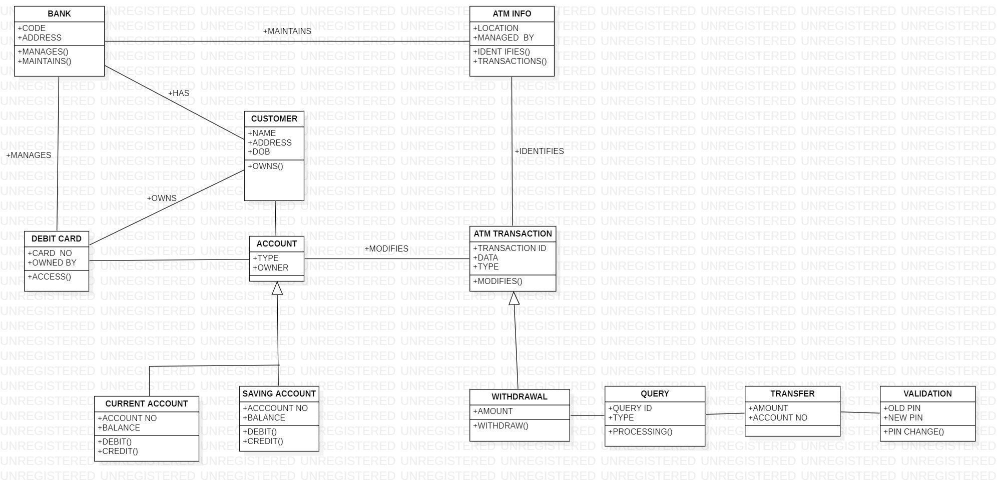
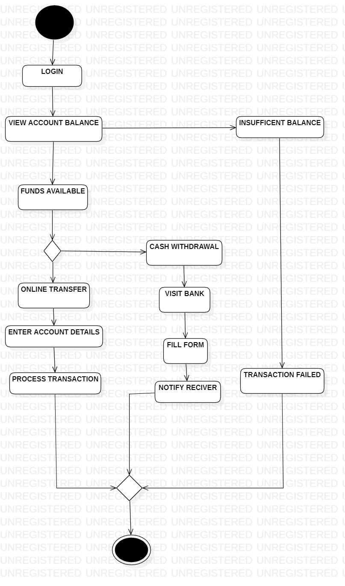
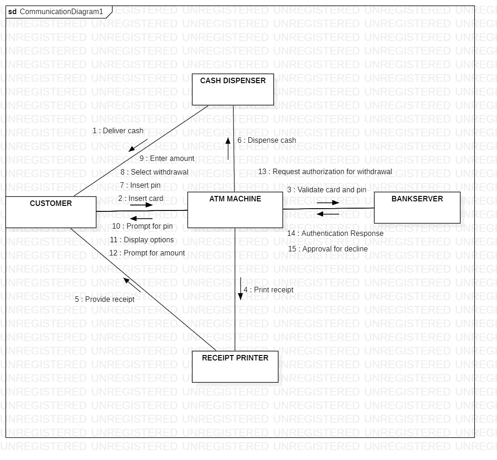
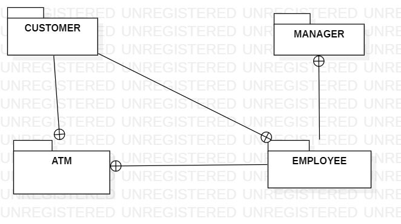
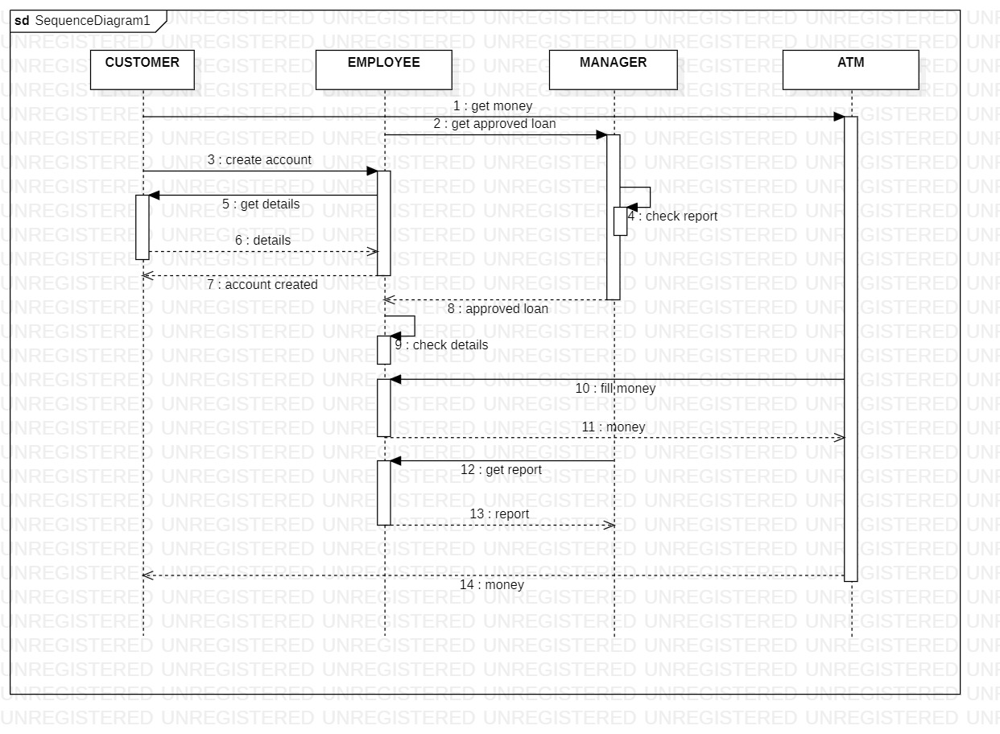

# Exp-1 ATM & BANKING SYSTEM

# AIM:
To study the problem statement ,SRS document and draw the UML diagram of library management system system
# SRS (Procedure):
A Library Management System UML Diagram represents the design of how different components of a library interact. It typically includes several types of UML diagrams. Here's a simple explanation of each, along with the most important one: the Class Diagram.
Use Case Diagram
Shows actors and system functionalities.
Actors: Librarian, Member
Use Cases: Search Book, Issue Book, Return Book, Add Book, Remove Book, Pay Fine
Sequence Diagram (Example: Book Issue Process)
Shows object interactions in time sequence:

Actor: Member

Objects: Library System → Book → Borrower
Activity Diagram
Describes the flow of activities (like issuing a book).
47
List of Programs:

i) Usecase Diagram

ii)Class Diagram

iii)Activity Diagram

iv)Communication Diagram

v)Package Diagram

vi)Sequence Diagram
# DIAGRAMS:
USECASE DIAGRAM

CLASS DIAGRAM

ACTIVITY DIAGRAM

COMMUNICATION DIAGRAM

PACKAGE DIAGRAM

SEQUENCE DIAGRAM

# RESULT:
Thus, the "ATM & BANKING SYSTEM" project created,executed & the output was verified